# 🃏 Coup - Jogo de Blefe

## 🚀 Tecnologias Utilizadas

Este jogo foi desenvolvido com uma arquitetura baseada em "Casos", utilizando as seguintes tecnologias:

- **Backend**: TypeScript + Socket.io  
- **Frontend**: React.js, HTML5 e CSS  
- **Hospedagem**: Vercel (para testes e acesso por interessados)

---

## 🧠 Diagrama de Fluxo dos Casos

Você pode visualizar o fluxo de jogo no Figma:

🔗 [Clique aqui para acessar o diagrama](https://www.figma.com/board/sGqF8YojKQOT6kPXdZH1Af/Coup?node-id=0-1&p=f&t=bDc8WWyr0Ie7DdVc-0)

---

## 🎯 Objetivo do Jogo

*Coup* é um jogo de blefe onde os jogadores representam personagens com habilidades únicas. A sacada está em fingir ser personagens que você **não possui**, arriscando ser desmascarado e perder uma influência.

- Cada jogador começa com **2 moedas** e **2 cartas (influências)**.
- O objetivo é eliminar todas as influências dos outros jogadores e ser o **último sobrevivente** na mesa.

> Seja o maior golpista da mesa e saia vencedor!

---

## 🧑‍🤝‍🧑 Preparação e Jogadores

- O jogo possui **5 personagens básicos**.
- Para **até 5 jogadores**, utilize **3 cópias** de cada personagem.
- Para **6 a 8 jogadores**, utilize **4 cópias** de cada personagem.

---

## 🔁 Estrutura da Rodada

Na sua vez, o jogador pode realizar **uma ação**. Depois, a vez passa para o próximo jogador.

### 🔹 Ações Básicas (não dependem de personagem)

- **Renda**: Pegue 1 moeda do banco (ação não pode ser bloqueada).
- **Ajuda Externa**: Pegue 2 moedas do banco (pode ser bloqueada pelo **Duque**).
- **Golpe de Estado (Coup!)**: Pague 7 moedas para eliminar uma influência de outro jogador.  
  - Não pode ser bloqueada ou contestada.  
  - É obrigatória quando o jogador tiver **10 moedas ou mais**.

### 🔸 Ações de Personagens

Essas ações são feitas **sem revelar a carta**. Porém, qualquer outro jogador pode **contestar**.  
Se o jogador estiver mentindo, perde uma influência. Se estiver falando a verdade, quem contestou é punido.

> ⚠️ Bloqueios só podem ser usados quando o jogador for **alvo direto** da ação.

- **Duque**: Pegue 3 moedas do banco. Pode bloquear **Ajuda Externa**.
- **Assassino**: Pague 3 moedas para eliminar uma influência de um jogador.  
  - Se for contestado e estiver certo, o alvo perde **duas cartas**.
- **Capitão**: Roube 2 moedas de outro jogador.  
  - Pode ser bloqueado por **Capitão** ou **Embaixador**.
- **Embaixador**: Compre 2 cartas do baralho e devolva 2 (à sua escolha).  
  - Também pode bloquear a extorsão do Capitão.
- **Condessa**: Pode **bloquear o Assassino**.  
  - ❗ Não pode bloquear assassinatos que não sejam direcionados a ela.

---

## 🏆 Final de Jogo

O jogo termina quando **apenas um jogador** tiver influências restantes.  
Este jogador é declarado **vencedor**!

---

## 🎨 Design das Cartas

  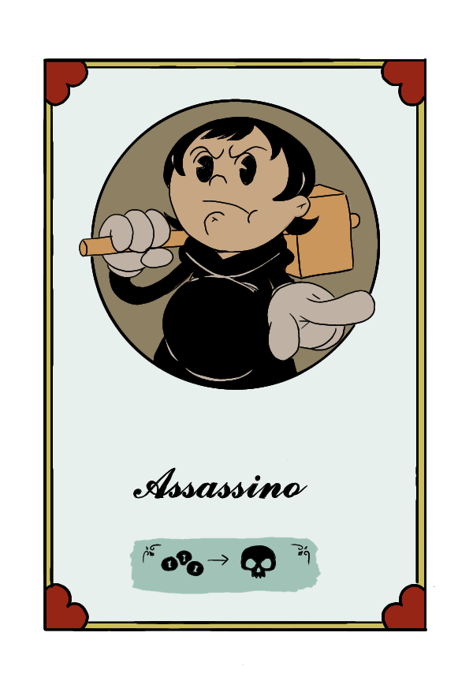
  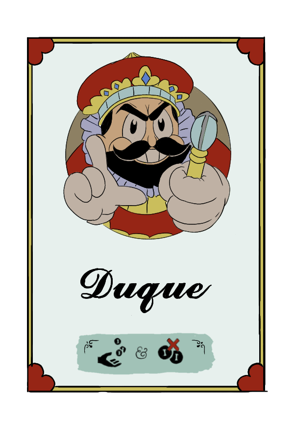
  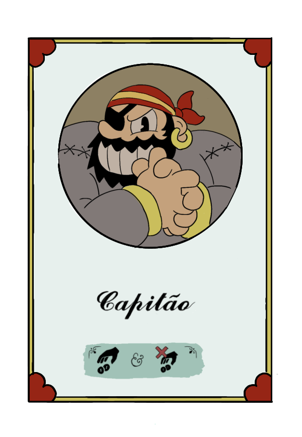
  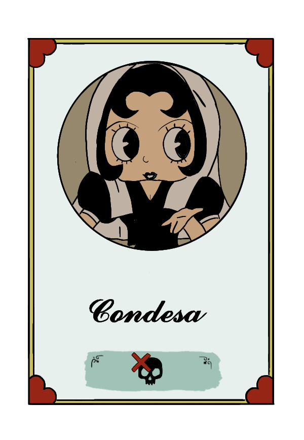
  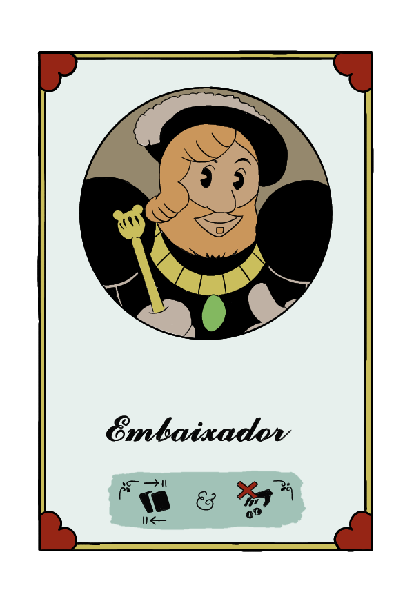
  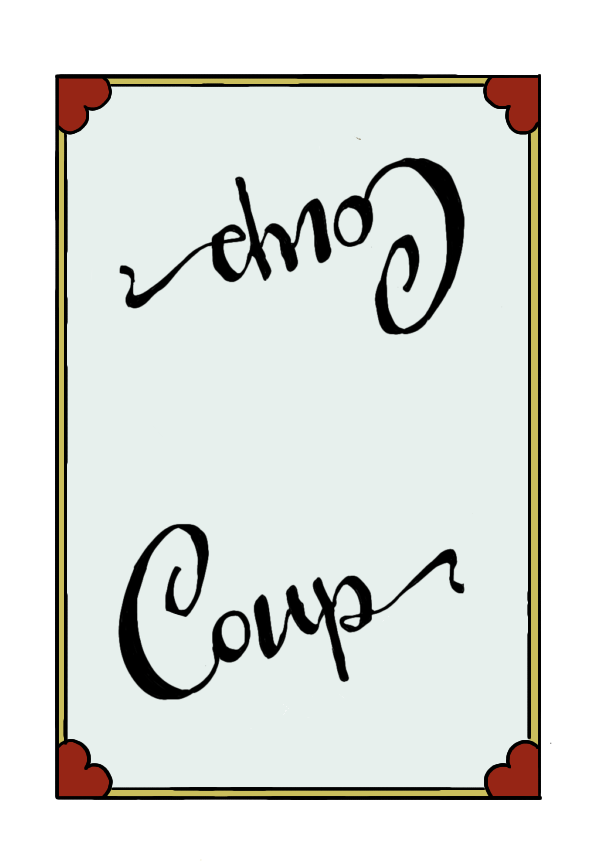

  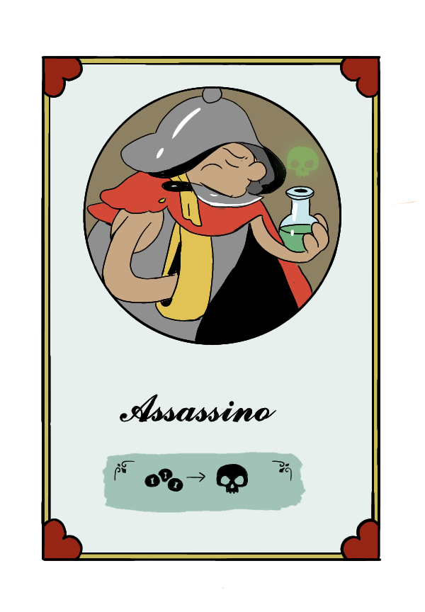
  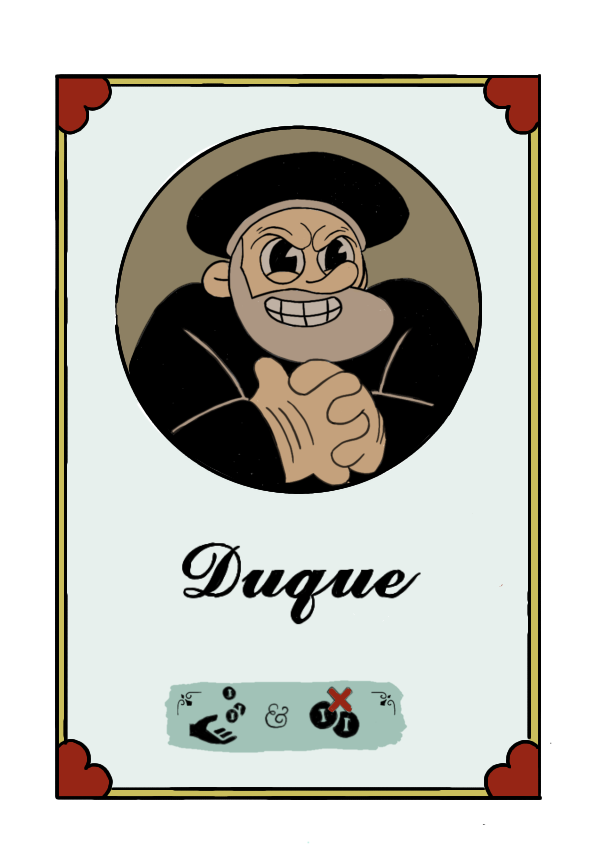
  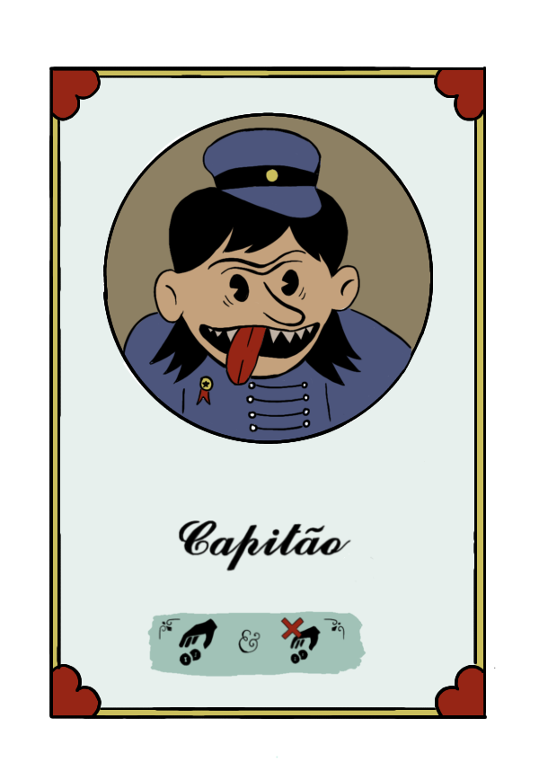
  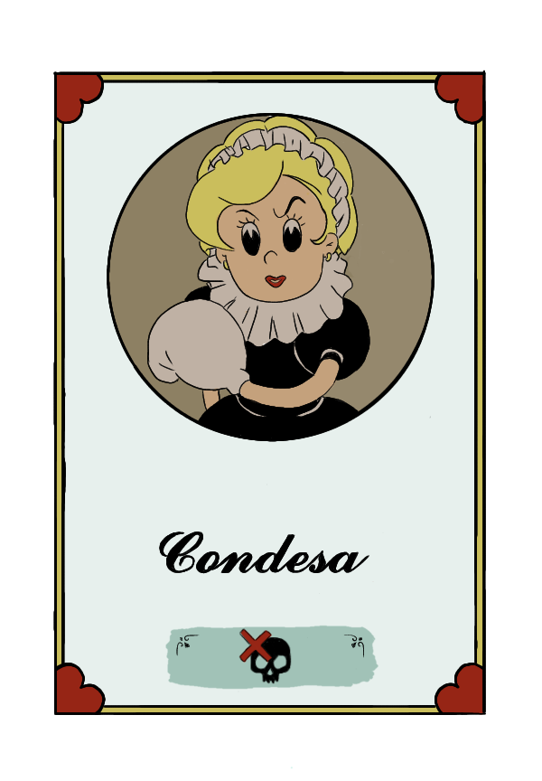
  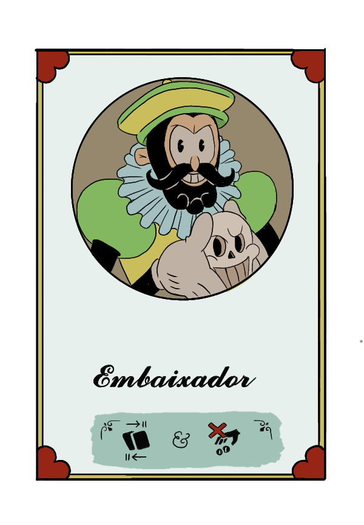

